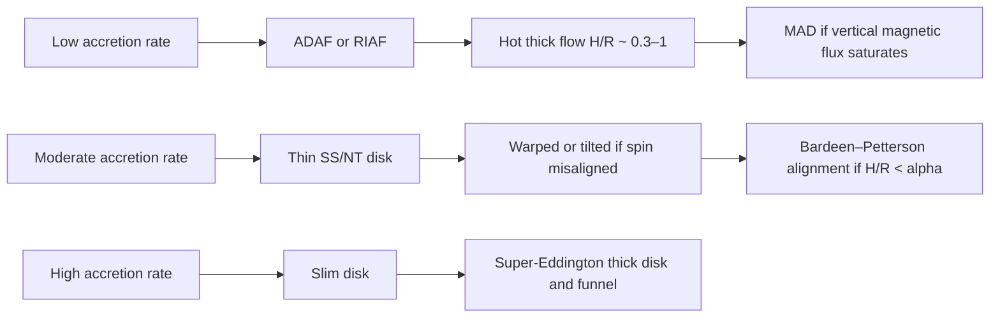
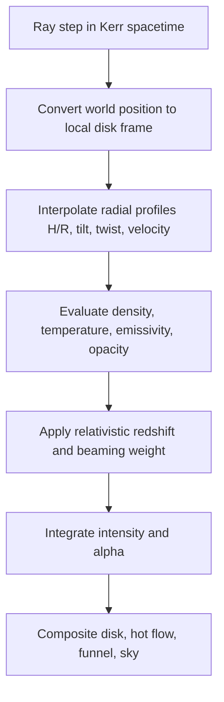

# Physical Geometry of Black Hole Accretion Disks and a Code Upgrade Path for black_hole

## Executive summary

Your current repository is not a generic Python or C++ accretion-disk codebase; it is a **Rust + Bevy + WGSL** real-time ray-traced visualiser. The present disk model is a **single, axisymmetric disk aligned with the +Y axis**, with an **inner edge fixed at the Kerr ISCO**, a **runtime-adjustable outer radius**, a **hard-coded thickness parameter of 0.1**, and a **Gaussian vertical emissivity profile** with local scale height \(H(R)=0.1\,R\). The shader colours the disk with a **Novikov–Thorne-inspired temperature profile**, a pseudo-blackbody colour map, and an approximate Kerr orbital boosting scheme based on Doppler and lapse factors. At runtime, the disk geometry is controlled only by **spin** and **outer radius**. citeturn34view2turn15view0turn9view0turn17view0turn14view0turn14view1turn14view2

That model is visually effective, but it collapses several physically distinct accretion geometries into one surrogate. Modern theory and simulation show that disk shape depends primarily on **Eddington-scaled accretion rate**, **cooling efficiency**, **magnetic flux content**, and **misalignment between disk and black-hole spin**. Thin Shakura–Sunyaev / Novikov–Thorne disks are geometrically thin and radiatively efficient; slim disks become advective and puff up; pressure-supported tori and ADAF/RIAF flows are intrinsically thick; tilted disks can warp, precess, or align through the Bardeen–Petterson effect; and MAD states can create magnetically supported inner regions, strong jets, and substantial departures from standard thin-disk expectations. citeturn19search0turn19search1turn19search2turn19search3turn20search0turn20search1turn23search2turn21search0turn21search1turn23search23

Observations reinforce that no single geometry is universally correct. Thermal continuum fitting and reflection spectroscopy are most naturally interpreted with thin inner disks in soft states; reverberation and spectral-timing studies often favour a **truncated thin disk plus inner hot flow** in hard states; mm-VLBI imaging of **M87\*** and **Sgr A\*** is best explained by **hot, magnetised, radiatively inefficient near-horizon flows**, with EHT polarimetry favouring **magnetically dominated / MAD-like** solutions for M87\*. citeturn26search0turn26search12turn26search1turn26search25turn27search6turn27search8turn31academia32turn35search26turn31search4turn30search5turn30search11

The most valuable code upgrade, therefore, is not a finer version of the current fixed-thickness disk. It is a **modular geometry system** that separates:  
**geometry** \(H(R)\), **inner edges** \(r_{\rm ISCO}\), \(r_{\rm emit}\), \(r_{\rm trunc}\), **orientation** \((\beta(R),\gamma(R))\), **velocity field**, and **emissivity / opacity law**. In practice, I recommend adding at least four presets: **thin thermal**, **truncated thin + inner hot flow**, **slim / super-Eddington funnel**, and **warped / tilted thin disk**, with an optional **thin-MAD** variant. That will move the repo from a single visual trope to a physically extensible renderer. citeturn22search1turn33view0turn32view2turn21search0turn25academia31turn29search1

## Current repository review

The repository is organised around a Bevy render graph that dispatches a compute shader every frame. The README explicitly says that `src/compute/pipeline.rs` feeds **camera**, **Kerr / disk parameters**, and **scene objects** into `assets/shaders/geodesic.wgsl`, which then traces each pixel as a **null geodesic** through curved spacetime and writes the output to a fullscreen texture. The relevant source tree visible in the repository includes `src/simulation.rs`, `src/physics.rs`, `src/camera.rs`, `src/compute/mod.rs`, `src/compute/pipeline.rs`, and shader assets under `assets/shaders/`. citeturn34view2turn5view1turn5view2turn5view3turn11view0

| Component | What it does now | Geometry / emission relevance | Evidence |
|---|---|---|---|
| `src/simulation.rs` | Owns runtime disk config and user controls | Defines `DiskConfig { spin, r_outer_rs }`, default spin **0.82**, default outer radius **15 \(r_s\)**; runtime keys Q/E and Z/X adjust spin and outer radius | citeturn34view0turn34view1turn34view2turn34view3 |
| `src/compute/mod.rs` | Extracts render resources | Defines `DiskConfigUniform` with only `spin` and `r_outer_rs` | citeturn15view0turn15view1 |
| `src/compute/pipeline.rs` | Builds GPU-side disk uniform | `GpuDiskUniform` contains `r1`, `r2`, `num`, `thickness`, `spin`, `horizon_r`, `isco_r`; `build_disk_uniform()` sets `r1=ISCO`, `r2=SAGA_RS*r_outer_rs`, `thickness=0.1`, `num=2.0` | citeturn9view2turn9view0turn18view2 |
| `assets/shaders/geodesic.wgsl` | Performs geometry, boosting, and ray-marching | Disk axis is fixed to **+Y**; disk density is Gaussian in height; local thickness is \(H= {\tt thickness}\times R\); emission uses a Novikov–Thorne-like radial profile with Doppler/lapse boosting | citeturn17view0turn13view1turn14view0turn14view1turn14view2 |
| `src/physics.rs` | Kerr radii helpers | Exposes `kerr_horizon_radius` and `kerr_isco_radius`; repo comments identify the Schwarzschild limits and Bardeen–Press–Teukolsky-style formulas | citeturn6view1turn6view3turn6view4 |
| `src/camera.rs` | Orbital camera / debug controls | Useful for validation because it can orbit, zoom, vary FOV, and toggle an iteration heatmap | citeturn16view0turn16view1turn16view4 |

The current disk data model is therefore extremely compact. On the CPU side, geometry is effectively represented by **only two user-facing parameters**: spin and outer radius. On the GPU side, the effective geometry is still almost entirely radial: inner radius is forced to the ISCO, thickness is fixed, and the only vertical structure is a Gaussian envelope about a global equatorial plane. There is no explicit disk tilt, twist, truncation radius, photosphere height, density scale, temperature normalisation, opacity law, radiation band choice, or magnetic-flux state in the exposed configuration. citeturn15view0turn9view0turn13view1turn14view2

The shader’s emissivity model is a hybrid of plausible ingredients and visual heuristics. Radially, it uses `nt_temp(r)` with the expected zero at the ISCO and a decline outward; colour is then assigned through a hand-crafted colour ramp rather than a frequency-dependent spectrum. Kinematically, the shader computes an equatorial orbital speed from a Kerr-based angular velocity, includes frame dragging and lapse, and brightens the disk by a cube of the resulting Doppler factor. Vertically, colour is accumulated volumetrically by ray-marching through a Gaussian density field, with opacity-like alpha accumulation but without a band-dependent transfer equation. citeturn14view0turn14view1turn14view2turn13view5

Two implementation details matter for your upgrade path. First, the renderer is already using a **physical Kerr ISCO / horizon infrastructure**, so you do not need to replace that part; you need to generalise what “the disk” means relative to those radii. Second, the project is scaled to **Sgr A\***-like physical constants (`SAGA_RS`, `SAGA_MASS`) rather than being fully dimensionless in \(r_g=GM/c^2\). That is workable for one target, but it is inconvenient if you want the same code to represent X-ray binaries, AGN thin disks, and EHT hot flows with one geometry API. citeturn34view0turn17view1

The immediate engineering conclusion is that your current code does **not** lack relativity; it lacks a **state-dependent geometry layer**. The simplest physically meaningful refactor is to replace the single scalar `thickness` with a **model family + radial profiles**. Also worth noting: the `num` field is hard-coded to `2.0` in the GPU disk uniform, but I did not find any evidence in the shader that it is currently used for geometry or emissivity, so it appears vestigial in the accessible code. citeturn18view2turn18view0

## Theoretical models of disk shape and thickness

Across the literature, accretion geometry is best thought of as a **regime problem**, not a single model problem. The physically important control parameters are accretion rate, cooling efficiency, thickness \(H/R\), magnetic flux, and tilt. A key subtlety for code design is that the “inner edge” is **not uniquely defined** once luminosity, advection, or magnetic stresses become important: at low luminosity several operational edge definitions may coincide near the ISCO, but at higher luminosity or stronger magnetic stress they can separate. citeturn22search1turn19search1turn19search2turn22search13

A practical regime map for implementation is:



This taxonomy follows the classic thin/slim/hot-flow literature and the later GRMHD / GRRMHD work on tilt and magnetic arrest. citeturn19search0turn19search2turn33view0turn21search0turn32view2turn25academia31

| Model | Geometry and key equations | Inner edge and spin dependence | Validity / physical regime | Primary references |
|---|---|---|---|---|
| **Thin Shakura–Sunyaev / Novikov–Thorne disk** | Geometrically thin, optically thick, radiatively efficient; \(H \sim c_s/\Omega_\perp\), \(H/R \ll 1\); viscous closure \(W_{r\phi}=\alpha P\); standard energy balance is local \(Q^+=Q^-_{\rm rad}\) | Standard model identifies the radiating inner edge with \(r_{\rm ISCO}(a_\*)\); spin mainly enters through the ISCO and relativistic transfer | Best for thermally dominated, radiatively efficient states | citeturn19search0turn19search1turn26search0turn26search12 |
| **Slim disk** | Advection becomes important, so \(Q^+=Q^-_{\rm rad}+Q_{\rm adv}\); moderate thickness \(H/R\sim 0.1\) up to order unity; photon trapping and radial heat advection matter | Effective emitting edge can move inward relative to the thin-disk ISCO picture; one must separate dynamical, radiative, and photospheric edges | Near-Eddington and super-Eddington accretion, especially when thermal spectra remain disc-like | citeturn19search2turn22search1turn25search1turn25academia31 |
| **Thick torus / Polish doughnut** | Pressure-supported torus with \(H/R\sim 0.3\)–1, often low-viscosity and roughly constant specific angular momentum; classic geometries have a cusp and axial funnels | Inner cusp typically lies between the marginally stable and marginally bound orbits, so the “edge” is not just the ISCO | Useful as an analytic thick-flow surrogate and GRMHD initial condition | citeturn20search0turn20search1turn20search9turn20search14 |
| **ADAF / RIAF** | Virial-hot, optically thin, quasi-spherical or very thick \(H/R\sim 0.3\)–1; sub-Keplerian rotation, strong advection, jets and winds expected | The hot flow can extend to the horizon, but observationally it often coexists with an outer truncated thin disk; the relevant “edge” is often a truncation radius rather than ISCO emission | Low accretion-rate hard/quiescent BH states and low-luminosity AGN | citeturn19search3turn19search7turn33view0turn33view3 |
| **Thin-disk GRMHD / SANE-like thin flow** | Still thin, but MHD turbulence gives non-zero stress near and slightly within the ISCO; plunging-region light is small but not identically zero | Thin SANE disks generally remain close to Novikov–Thorne, but the zero-torque / dark-plunge assumptions are only approximate | Best representation of real thin disks when magnetic stress is not extreme | citeturn22search0turn22search13turn22search2 |
| **Radiation-supported super-Eddington GRRMHD flow** | Thick inner disk, winds, and narrow polar funnels; recent radiation-GRMHD surveys find geometrically thick radiation-pressure-supported disks and funnel-shaped photospheres | Observable morphology is often set by the photosphere / funnel walls, not by a razor-thin midplane | ULXs, rapidly accreting AGN, supercritical episodes | citeturn22search30turn25search1turn25search15turn25academia31 |
| **Warped / tilted disk with Bardeen–Petterson effect** | Geometry described by local tilt \(\beta(r)\) and twist \(\gamma(r)\); Lense–Thirring torque gives \(\Omega_{\rm LT}\propto a_\* r^{-3}\); if \(\alpha \gtrsim H/R\), warps diffuse and inner alignment is expected, whereas if \(\alpha \lesssim H/R\), warps propagate as bending waves | The alignment radius \(r_{\rm BP}\) is model-dependent; thin MHD simulations find much smaller alignment radii than older analytic estimates | Misaligned feeding in thin or moderately thin disks | citeturn23search4turn23search2turn32view2turn21search9 |
| **MAGnetically Arrested Disk** | Large-scale vertical magnetic flux saturates the hole and inner flow; magnetic pressure can impede accretion, generate jets, and alter thickness and inner structure | The relevant edge may be a magnetically dominated low-density inner zone or magnetic truncation region, not a simple ISCO surface | Jet-producing systems, strongly magnetised low- or high-accretion-rate flows | citeturn21search0turn21search4turn21search23turn22search3turn22search15 |

Three theoretical points are especially important for your code. First, **\(H/R\) is not a cosmetic parameter**: it changes the validity of the flow equations, the warp propagation regime, and the expected location of the emission surface. Second, **the ISCO is indispensable but insufficient**: in thin disks it is a good proxy for the inner radiating edge, while in slim, MAD, and hot flows it is only one of several meaningful radii. Third, **tilt and magnetic flux are first-order geometry controls**, not secondary decorations. Modern GRMHD has shown both a genuine Bardeen–Petterson inner alignment in very thin disks and strong magnetic restructuring of thin disks that analytic razor-thin models do not contain. citeturn22search1turn32view2turn21search0turn22search3

If you want representative figures to study while implementing, the most useful modern examples are the **tilt profile and aligned inner disk in Liska et al. 2019**, the **EHT model-comparison crescents in M87 Paper V**, and the **thick super-Eddington funnels in recent GRRMHD surveys**. citeturn32view2turn31search4turn25academia31

## Observational constraints on disk geometry

Observationally, geometry is inferred indirectly. Different techniques probe different radii and different emitting components, so the most robust inferences come from **joint consistency** between thermal continuum, reflection, timing, reverberation, polarimetry, and horizon-scale imaging. citeturn26search12turn32view3turn31search4

| Observable | What it constrains | Geometric inference most directly tied to it | Main caveat | Representative sources |
|---|---|---|---|---|
| **Thermal continuum fitting** | Inner emitting radius of a thin, optically thick disk, hence spin under a Kerr assumption | Best suited to soft-state thin disks close to the Novikov–Thorne picture | Requires reliable mass, distance, inclination, and a truly thin thermal state | citeturn26search0turn26search12turn26search4 |
| **Relativistic Fe K\(\alpha\) reflection** | Inner radius, inclination, emissivity concentration, spin, and coronal illumination pattern | Broad skewed red wings imply emission from the strongly relativistic inner disk | Degenerate with ionisation, density, coronal geometry, and disk thickness | citeturn26search1turn26search25turn26search17 |
| **X-ray reverberation mapping** | Light-travel scales between corona and disk | Measures compact coronal heights and inner-disk response; in Seyferts, typical coronal heights are of order a few \(r_g\) | Dilution and returning radiation alter naive lag-to-height conversion | citeturn32view3turn27search6turn27search4 |
| **Spectral-timing in BH binaries** | Truncation radius and size of the hot inner flow | Hard-state variability often favours a truncated thin disk with inner hot thick flow; GX 339-4 hard-state modelling finds \(r_{\rm in}\sim 20\,r_g\) | Hard-state geometry remains debated in some sources | citeturn27search8turn28search2turn28search14 |
| **mm-VLBI total intensity** | Ring diameter, width, brightness asymmetry, viewing geometry near the horizon | Strongly constrains hot-flow morphology and line of sight for M87\* and Sgr A\* | Image morphology alone is not a unique plasma model discriminator | citeturn31academia32turn35search26turn26search19 |
| **mm-VLBI polarimetry** | Ordered magnetic-field geometry close to the hole | Favours magnetically dominated near-horizon flows in M87\* and organised magnetic structure in Sgr A\* | Requires plasma and Faraday-rotation modelling | citeturn31academia31turn30search5turn30search11turn35news33 |
| **X-ray polarimetry** | Disk-corona-jet geometry and misalignment | Can distinguish compact static coronae from extended / outflowing structures and reveal spin-orbit misalignment | Model-dependent interpretation | citeturn30search4turn30search10turn29search14 |

Two X-ray constraints are especially relevant for a code that aims to span multiple accretion states. In thermal soft states, continuum fitting and reflection both lean toward **thin inner disks close to the ISCO**. In hard states, however, reverberation plus spectral-timing frequently indicates that the thin disk is **truncated** and replaced inside by a **geometrically thick hot flow**, precisely the composite geometry that your current single-disk model cannot express. citeturn26search0turn26search12turn27search8turn28search14

Reverberation is particularly useful because it constrains **vertical** as well as radial geometry. The AGN reverberation review emphasises that light echoes replace angular resolution with time resolution, and later modelling shows that Seyfert coronae are typically only **a few gravitational radii** above the disk. In stellar-mass binaries, reverberation-informed hard-state modelling of GX 339-4 yields a disk inner radius of order **\(20\,r_g\)** rather than an ISCO-hugging disk. citeturn32view3turn27search6turn27search8

The EHT results are the strongest modern constraints on **hot near-horizon flow geometry**. For M87\*, geometric model fitting measured a crescent diameter of **\(42\pm3\,\mu{\rm as}\)** and found that emission is strongly suppressed in the interior; Paper V showed that the observed asymmetry is consistent with strongly lensed synchrotron emission from hot plasma near the event horizon and found that non-spinning models in the library did not produce sufficiently powerful jets. At 3.5 mm, a later M87 result found a **larger and thicker ring-like structure**, implying a substantial accretion-flow contribution and absorption in addition to the narrow lensed ring seen at 1.3 mm. citeturn31academia32turn31search4turn26search19

For Sgr A\*, the first EHT analyses found a bright thick ring with diameter **\(51.8\pm2.3\,\mu{\rm as}\)** and disfavoured **high inclination**, **non-spinning**, and **retrograde-disk** scenarios in their model comparisons. Polarimetric imaging later revealed a spiral-like organised field structure resembling M87\*, which again argues that your code should eventually be able to represent **thick, magnetised, horizon-scale flows**, not just thermal thin disks. citeturn35search26turn31search2turn35news33

Finally, there is now direct observational motivation to treat **MAD** as an observable regime, not only a simulation construct. A 2023 *Science* study of MAXI J1820+070 interpreted multi-wavelength delays during outburst evolution as evidence for the formation of a **magnetically arrested disk**, while IXPE and later modelling of Cyg X-1 suggest geometries involving either extended coronae, outflowing structures, or genuine spin-orbit misalignment. citeturn29search1turn29search0turn30search4turn29search14

## Analytic models versus GRMHD

The broad lesson from simulations is not that analytic models are wrong; it is that each analytic model is a **controlled asymptotic limit**. GRMHD and GRRMHD mostly preserve the qualitative taxonomy, but they add non-zero magnetic stress, finite plunge emission, corona formation, wind launching, magnetic truncation, and state-dependent differences between density structure, photosphere, and emissivity. citeturn22search13turn22search2turn22search3turn25academia31turn32view2

| Flow class | Analytic expectation | GRMHD / GRRMHD result | What this means for code | Representative sources |
|---|---|---|---|---|
| **Thin SANE-like disk** | \(H/R\ll1\), inner edge at ISCO, negligible plunge emission | Usually remains close to Novikov–Thorne, but with non-zero stress and small non-zero plunging-region light | Keep an NT mode, but add an optional weak intra-ISCO emissivity tail and do not hard-code “dark plunge” | citeturn22search0turn22search13turn22search2 |
| **Thin MAD disk** | Still thin in appearance, but strong vertical flux is usually not captured in classical NT theory | Avara et al. found thin \(H/R\approx0.1\) MAD disks can deviate strongly from NT efficiency, roughly doubling radiative efficiency for \(a=0.5\) | Add a thin-MAD preset with inner magnetic support / partial evacuation and stronger coronal-funnel emission | citeturn22search3turn22search15 |
| **Tilted thin disk** | Classic BP theory predicts inner alignment at a model-dependent \(r_{\rm BP}\), often large | Liska et al. simulated a very thin \(H/R\approx0.03\) tilted disk and found inner alignment inside \(\sim5\,r_g\), with a magnetic-pressure-dominated inner region at \(r\lesssim25\,r_g\) | Warp should be parameterised independently from thickness; use a small \(r_{\rm BP}\) option, not only large analytic values | citeturn32view2turn21search9 |
| **Thicker tilted disk / corona** | Older expectations sometimes extrapolated BP alignment to all tilts | Thicker flows and coronae tend to show tilt oscillations / precession rather than clean BP alignment | Do not force inner alignment for all tilted models; tilt behaviour should depend on \(H/R\) and \(\alpha\) regime | citeturn23search2turn32view2 |
| **Slim / near-Eddington disk** | Moderately thick, advective, photosphere inflated relative to thin disk | Radiation-GRMHD confirms advection and photon trapping, but the actual photosphere, wind, and emission surface are more complex than height-integrated slim prescriptions | For rendering, use a puffed-up photosphere model with separate emissive surface and wind / funnel components | citeturn19search2turn25search1turn25academia31 |
| **Super-Eddington funnel flow** | Thick disk with narrow funnels in Polish-doughnut / supercritical pictures | 3D radiation-MHD shows thick radiation-supported disks, strong equatorial outflows, and narrow funnel-shaped photospheres | Add a funnel-wall emitting component and do not model these systems as thickened thin disks alone | citeturn25search15turn22search30turn25academia31 |
| **Hot RIAF / ADAF** | Thick, quasi-spherical, sub-Keplerian, optically thin, wind-producing | GRMHD broadly supports this picture and shows such flows easily sustain large-scale magnetic flux and jets | Use a separate volumetric hot-flow component with \(H/R\sim0.5\)–1 and sub-Keplerian rotation | citeturn33view0turn33view3turn21search23 |
| **MAD hot flow** | Magnetic arrest plus thick flow implies strong jet launching | Spin dependence of saturated magnetic flux and jet power is strong in MAD simulations | Magnetic-flux state should be a first-class parameter if you want M87-like presets | citeturn21search0turn21search23 |

For implementation, the most important GRMHD correction is conceptual: **replace one “inner radius” with several radii**. In practice you want at least  
\(r_{\rm ISCO}\),  
\(r_{\rm emit,in}\),  
\(r_{\rm trunc}\),  
\(r_{\rm BP}\), and  
optionally \(r_{\rm mag}\) or a funnel-opening profile.  
That single design decision will let one renderer cover soft-state X-ray binaries, hard-state truncated flows, EHT hot flows, and tilted disks without changing the ray integrator. citeturn22search1turn32view2turn21search0turn31search4

## Recommended geometry upgrades for the repo

Because the current code already has a functioning Kerr geodesic engine, the most efficient path is to **leave geodesic integration in place** and insert a **state-dependent geometry/emissivity layer** between “world position along the ray” and “sample disk colour”. Since the code is Rust/Bevy/WGSL, a clean design is to compute **radial profile tables on the CPU**, upload them as uniforms or sampled buffers, and let the shader evaluate local density, orientation, and emissivity at each ray step. citeturn34view2turn14view2

The single most important structural change is to move from fixed Sgr A\*-scale constants to a **dimensionless \(r_g\) geometry core**. Your repo currently mixes physical Sgr A\* constants and rendering geometry directly. Use \(G=M=c=1\) internally, convert all radii to \(r_g\), and only apply source-specific mass / distance at the presentation layer. That will make the same code path work for X-ray binaries, AGN, and EHT-style targets. citeturn17view1turn34view0

A practical rendering pipeline is:



This is a minimal extension of your present shader, which already performs the last two blocks in simplified form. citeturn14view1turn14view2

I recommend the following preset geometries as the first implementation target:

| Preset | Geometry recipe | Practical starting values | Why it is worth implementing | Anchoring sources |
|---|---|---|---|---|
| **Thin thermal** | Untilited disk with constant or weakly varying \(H/R\), \(r_{\rm emit,in}=r_{\rm ISCO}\) | \(H/R=0.02\) to \(0.05\); no truncation; thermal emissivity peaked in inner few \(r_g\) | Soft-state / continuum-fitting benchmark; also the cleanest replacement for current visual mode | citeturn19search0turn19search1turn26search0 |
| **Hard-state truncated thin + hot flow** | Thin outer disk plus inner volumetric hot flow | \(r_{\rm trunc}=10\) to \(100\,r_g\); \(H/R_{\rm thin}\sim0.02\); \(H/R_{\rm hot}\sim0.5\) to 1 | Matches reverberation and spectral-timing constraints far better than one thickened thermal disk | citeturn27search8turn28search14turn33view0 |
| **EHT hot flow** | Thick volumetric RIAF with optional weak outer disk | \(H/R\sim0.5\) to 1; emission concentrated at \(R\sim3\) to \(10\,r_g\) | Needed for M87\* / Sgr A\*-like images | citeturn31search4turn35search26turn31academia31 |
| **Slim / super-Eddington** | Outer disk transitions to puffed-up inner photosphere and funnel walls | Outer \(H/R\sim0.05\), inner \(H/R\sim0.2\) to 0.6, plus funnel opening \(\sim10^\circ\)–\(30^\circ\) | Captures advection and funnel morphology without full GRRMHD | citeturn19search2turn25academia31turn22search30 |
| **Warped / tilted thin disk** | Radius-dependent tilt \(\beta(R)\) and twist \(\gamma(R)\) | \(\beta_{\rm out}=10^\circ\)–\(60^\circ\); \(r_{\rm BP}=5\) to \(100\,r_g\) with smooth transition width \(0.2\)–\(0.8\) dex | Adds a whole class of physically motivated morphology with modest code cost | citeturn23search2turn32view2turn21search9 |
| **Thin MAD** | Thin outer disk plus magnetically modified inner region / enhanced funnel | \(H/R\sim0.03\)–0.1; inner magnetic transition around a few to tens of \(r_g\) | Needed if you want thin disks that deviate materially from NT or jet-producing “radio-loud quasar” presets | citeturn22search3turn32view2turn21search0 |

A mathematically simple but useful geometry library would define the following radial profiles.

For a **thin disk**:
\[
\frac{H}{R}(R)=h_{\rm thin},
\qquad
\rho(R,z)=\rho_0(R)\exp\!\left[-\frac{z^2}{2H^2(R)}\right].
\]

For a **truncated thin + hot flow**:
\[
w(R)=\frac12\left[1+\tanh\!\left(\frac{\ln R-\ln r_{\rm trunc}}{\Delta_{\rm tr}}\right)\right],
\]
\[
\frac{H}{R}(R)=w(R)\,h_{\rm thin}+\bigl(1-w(R)\bigr)h_{\rm hot}.
\]

For a **slim / puffed-up inner flow**:
\[
\frac{H}{R}(R)=h_{\rm out}+\frac{h_{\rm in}-h_{\rm out}}{1+(R/r_{\rm puff})^p}.
\]

For a **warped disk**:
\[
\beta(R)=\beta_{\rm out}\,\frac12\left[1+\tanh\!\left(\frac{\ln R-\ln r_{\rm BP}}{\Delta_{\rm BP}}\right)\right],
\qquad
\gamma(R)=\gamma_0+\gamma_1\ln\!\left(1+\frac{R}{r_{\rm BP}}\right).
\]

These are not full equilibrium solutions; they are **reduced-order surrogates** designed to preserve the right geometry classes while remaining easy to integrate into a real-time shader. They are directly motivated by the thin/slim/hot-flow and BP literature, and by the small alignment radius seen in modern tilted-GRMHD simulations. citeturn19search2turn33view0turn32view2turn21search9

A Rust-shaped data model could look like this:

```rust
#[derive(Clone, Debug)]
pub enum GeometryModel {
    ThinNt(ThinNtParams),
    TruncatedHotFlow(TruncatedHotParams),
    SlimFunnel(SlimParams),
    WarpedThin(WarpedThinParams),
    ThinMad(ThinMadParams),
    Torus(TorusParams),
}

#[derive(Clone, Debug)]
pub struct DiskState {
    pub a_star: f32,
    pub mdot_edd: f32,
    pub r_isco_rg: f32,
    pub r_emit_in_rg: f32,
    pub r_out_rg: f32,
    pub model: GeometryModel,
    pub atlas: RadialAtlas,
}

#[derive(Clone, Debug)]
pub struct RadialAtlas {
    pub r_rg: Vec<f32>,
    pub h_over_r: Vec<f32>,
    pub tilt_rad: Vec<f32>,
    pub twist_rad: Vec<f32>,
    pub omega: Vec<f32>,
    pub rho0: Vec<f32>,
    pub temp_eff: Vec<f32>,
    pub emissivity_norm: Vec<f32>,
    pub opacity_norm: Vec<f32>,
}
```

The corresponding sampling logic can remain close to your current shader model:

```rust
fn sample_disk(world_pos: Vec3, state: &DiskState) -> Option<DiskSample> {
    let r = world_pos.length();
    if r < state.r_emit_in_rg || r > state.r_out_rg {
        return None;
    }

    let beta = interp(&state.atlas.r_rg, &state.atlas.tilt_rad, r);
    let gamma = interp(&state.atlas.r_rg, &state.atlas.twist_rad, r);
    let local = rotate_into_local_disk_frame(world_pos, beta, gamma);

    let R = (local.x * local.x + local.z * local.z).sqrt();
    let h_over_r = interp(&state.atlas.r_rg, &state.atlas.h_over_r, R);
    let H = h_over_r * R.max(1e-4);

    let z = local.y;
    let rho0 = interp(&state.atlas.r_rg, &state.atlas.rho0, R);
    let rho = rho0 * (-0.5 * (z / H).powi(2)).exp();

    if rho < 1e-6 {
        return None;
    }

    let temp = interp(&state.atlas.r_rg, &state.atlas.temp_eff, R);
    let j0 = interp(&state.atlas.r_rg, &state.atlas.emissivity_norm, R);
    let a0 = interp(&state.atlas.r_rg, &state.atlas.opacity_norm, R);

    Some(DiskSample {
        rho,
        temp,
        emissivity: j0 * rho,
        opacity: a0 * rho,
        local_h: H,
    })
}
```

And the ray-marching loop should be upgraded from “colour + alpha accumulation” to “emissivity + opacity + redshift weight”:

```rust
for step in 0..max_steps {
    ray.advance_geodesic(dl);

    if let Some(s) = sample_disk(ray.position(), &disk_state) {
        let g = redshift_weight(ray, emitter_velocity(ray.position(), &disk_state));
        let dtau = s.opacity * dl;

        // Monochromatic: I_nu,obs ~ g^3
        // Bolometric surrogate: use a stronger g-weight if desired
        let source = g * g * g * band_emissivity(s.temp, s.emissivity);

        intensity = intensity * (-dtau).exp() + source * (1.0 - (-dtau).exp());
        alpha = 1.0 - (1.0 - alpha) * (-dtau).exp();
    }
}
```

That is the right level of ambition for this repository: do **not** attempt a full GRRMHD radiation code, but do stop hard-wiring one global equatorial Gaussian slab. The geometry layer should be cheap, tabulated, and expressive. citeturn14view2turn31search4turn25academia31

A further recommendation is to split **orbital velocity laws** by regime. Your current `orbital_kerr()` function is a good base for thin/slim modes. For hot flows, use a sub-Keplerian factor \(f_\Omega<1\) and permit inward radial drift. For toroidal pressure-supported modes, use a prescribed angular-momentum distribution rather than forced Keplerian rotation. That one change will materially improve image asymmetries and Doppler weighting in hard-state and EHT-style presets. citeturn13view5turn33view0turn20search0turn20search1

## Tests and validation

Validation should be done against **both internal invariants and published observables**. The right approach is to treat geometry as an API with regression tests, and observables as benchmark products. citeturn26search12turn32view3turn31search4

| Test or benchmark | Expected behaviour | Why it matters | Benchmark / source |
|---|---|---|---|
| **ISCO and horizon regression** | Recover Schwarzschild limits and monotonic prograde / retrograde trends already encoded in the Kerr helpers | Protects the most important relativistic geometry primitive | citeturn6view1turn6view3turn6view4 |
| **Untilted symmetry test** | Thin untilted mode should be symmetric under \(y\rightarrow -y\) apart from ray-tracing asymmetry from viewing inclination | Catches frame / warp bugs | Repo geometry convention citeturn17view0turn14view2 |
| **Thin-disk profile test** | Emission should vanish or sharply weaken near \(r_{\rm emit,in}\), peak in the inner disk, then decline outward | Confirms NT-like radial weighting | citeturn14view0turn19search1 |
| **Truncation test** | Increasing \(r_{\rm trunc}\) should enlarge reverberation lags and reduce extreme red-wing reflection | Ensures hard-state geometry behaves like a truncated disk plus hot flow | citeturn27search8turn28search14 |
| **Fe-line toy benchmark** | Higher spin and higher inclination should broaden and skew the profile more strongly | Good synthetic observable for inner-radius correctness | citeturn26search1turn26search25 |
| **Tilt / BP continuity test** | \(\beta(R)\) and \(\gamma(R)\) should remain smooth and converge as radial atlas resolution is increased; small-\(H/R\) tilted mode should align inside \(r_{\rm BP}\) when configured to do so | Protects warped-frame interpolation and the aligned-inner-disk feature | citeturn23search2turn32view2 |
| **EHT morphology benchmark** | Hot-flow presets should reproduce broad ring morphology with dim interior and reasonable asymmetry | Validates near-horizon thick-flow rendering | citeturn31academia32turn35search26turn31search4 |
| **Polarised / MAD future benchmark** | If you later add polarisation, M87-like presets should prefer organised near-ring field patterns and magnetically dominated libraries | Gives a route toward higher-fidelity EHT-style validation | citeturn31academia31turn30search5turn30search11 |

For datasets, you do not need to start from scratch. For X-ray validation, **HEASARC** is NASA’s designated archive for high-energy astrophysics and hosts public multi-mission data, including the **NuSTAR** archive and mission interfaces; ESA’s **XMM-Newton Science Archive** is the natural source for long reverberation observations. For horizon-scale validation, the **EHT data-products page** and EHT publication pages provide official image-domain and calibrated product entry points. citeturn35search3turn35search0turn35search21turn35search1turn35search17turn35search2

A sensible validation target list is:  
**GX 339-4** for hard-state truncation and reverberation;  
**Cygnus X-1** for continuum-fitting / reflection / polarimetry consistency checks;  
**MAXI J1820+070** for observational MAD-inspired outburst evolution;  
**IRAS 13224-3809**-style AGN reverberation for compact-corona lag tests;  
and **M87\*** plus **Sgr A\*** for hot-flow image morphology. Those targets map cleanly onto the geometry presets recommended above. citeturn27search8turn26search0turn30search4turn29search1turn27search4turn31academia32turn35search26

The most efficient release strategy would be to validate in this order:  
first **dimensionless Kerr geometry + thin disk**,  
then **truncated thin + hot inner flow**,  
then **warp / tilt**,  
then **slim / funnel**,  
and finally **thin-MAD / EHT hot-flow refinements**. That ordering tracks both the literature and your current code architecture: it maximises physical gain while minimising disruption to the existing geodesic renderer. citeturn14view2turn27search8turn32view2turn25academia31turn21search0